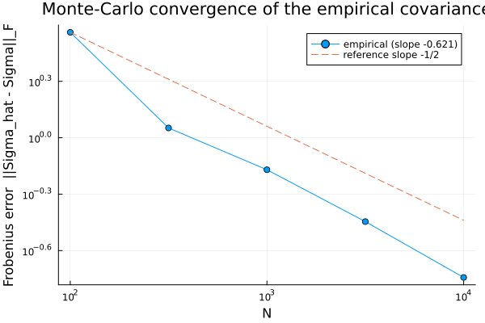
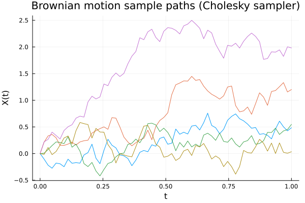

# 00 · Covariance core — does the sampler actually draw from the kernel?

The atomic operation the whole library rests on: draw a Gaussian process from a covariance
kernel, and confirm the samples really carry that covariance.

## The result

Estimate the covariance from `N` sample paths and measure its error against the true `Σ`. As
`N` grows, the error falls at the standard Monte-Carlo rate `‖Σ̂_N − Σ‖_F ∝ N^{−1/2}`. Fitting
the log–log slope and gating it against **−½** is the deliverable:



```
fitted slope = -0.6211 +/- 0.0533 (SE);  target = -0.5
GATE: PASS  (|slope + 1/2| < 2.5*SE)
```

A passing slope certifies **both** the sampler and the estimator at once — nothing else makes
the empirical covariance track the analytic kernel at exactly this rate.

## Concept

A Gaussian process is fixed entirely by its mean and its covariance kernel `R(s,t)`. On a grid
`t₁…tₙ` the covariance becomes a matrix `Σ_ij = R(tᵢ,tⱼ)`, and **sampling is applying a square
root of `Σ` to white noise**: factor `Σ = LLᵀ` (Cholesky), draw `z ∼ N(0,I)`, and `X = Lz` has
covariance `LLᵀ = Σ`. Here that machinery draws Brownian motion (`R(s,t) = min(s,t)`):



## How the check works, and why it bites

`assemble_cov`, `sample_cholesky`, and `empirical_cov` are the three primitives the rest of the
library is built on. This experiment runs all three together, end to end:

1. Assemble `Σ = assemble_cov(gp, t_grid)` and draw paths with `sample_cholesky`.
2. For `N` on a log-spaced ladder over `[10², 10⁴]`, form `Σ̂_N = empirical_cov(paths)` and
   measure the Frobenius error `‖Σ̂_N − Σ‖_F`.
3. Fit the log–log slope with a self-contained least-squares fit and gate it against theory:
   `|slope + ½| < 2.5·SE(slope)`.

The gate is *stochastic*: it compares the miss to a small multiple (2.5×) of the fitted slope's
own standard error, not to a fixed tolerance. `−½` is the asymptotic exponent; a 5-point
finite-`N` fit landing at `−0.62` is expected and still well inside the gate.

## Negative control — the nugget has to be load-bearing

Every feature ships a test that is *supposed* to fail. Here: at `jitter = 0`, the same
Brownian-motion `Σ` used above is exactly singular — its `t=0` row is identically zero because
`R(0,s)=0` — so `sample_cholesky` **must** throw `PosDefException`. The throw disappears once
`ε ≳ 1e-10`. This proves the nugget matters for the *real* matrix in the main check, not for a
contrived one. (Using Brownian motion is the honest choice: the well-conditioned
`exponential_kernel`, `cond ≈ 5.9e4` at 200 points, would *not* throw at `jitter = 0`.)

## Recorded configuration

Reproducibility conventions (why an explicit seed, why a nugget) live in the
[top-level README](../../README.md#conventions); this unit's concrete values:

- **Seed:** `StableRNG(20240501)`.
- **Jitter:** `1e-10` for the main check; `0.0` for the negative control.
- **Grid:** `N_GRID = 64` points on `[0, 1]`.
- **N-ladder:** `{100, 316, 1000, 3162, 10000}`.
- **Kernel:** `brownian_motion_kernel` (`Σ = min(t,s)`), for both the check and the control.
- **Error metric:** Frobenius norm `‖Σ̂_N − Σ‖_F`.

The seed is fixed, so the run is deterministic: every rerun reproduces the exact `(N, error)`
table and the slope `−0.6211`. A `FAIL`, or any drift from that slope, means the library code
changed — not an unlucky draw. (Margin at this config: `|slope + ½| = 0.121 < 2.5·SE = 0.133`,
≈ 9%.)

This experiment is Monte-Carlo — run it locally (`julia --project=.. run.jl`, from this folder,
using the shared `experiments/` env); it is **not** part
of CI. The two figures above are committed artifacts.
