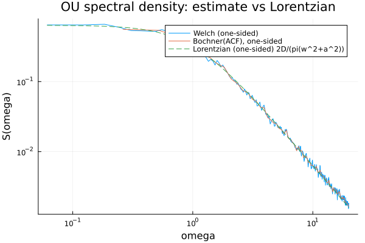
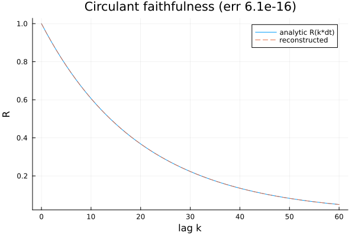
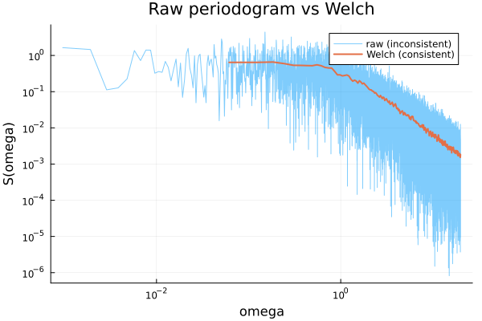
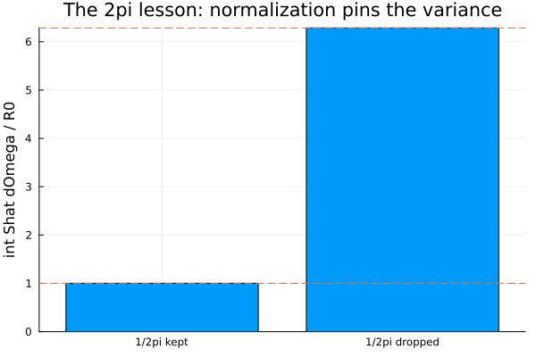

# 01 · Spectral / Bochner — the OU spectrum, estimated two ways

Stationarity moves all of a process's second-order structure onto the frequency axis (Bochner's
theorem). This unit estimates that spectrum, checks it against a closed form, and is the
repository's home for the two normalization traps every spectral estimator falls into.

## The result

A stationary Ornstein–Uhlenbeck process has covariance `R(τ) = (D/α)·e^{−α|τ|}` and, by the
Wiener–Khinchin / Bochner theorem, the **Lorentzian** spectral density `S(ω) = D/(π(ω²+α²))`.
Estimate `S` two independent ways from one long OU record — a **Welch** (averaged, windowed)
periodogram and a **Bochner-FFT** of the estimated autocorrelation — and both overlay the
analytic curve across the resolved band:



Two things are checked: the **shape** (both estimators track the Lorentzian) and the **total
power** (`∫Ŝ dΩ` recovers the variance `R(0) = D/α`). At this seed:

```
GATE (a) normalization: int Shat dOmega / R0 = 1.0016  -> PASS
GATE (b) shape L2: rel = 0.0752  vs  3/sqrt(nseg) = 0.3750  -> PASS
GATE (c) circulant faithfulness: ||r_recon - r|| / ||r|| = 6.149e-16, min(lambda) = 2.499e-02  -> PASS
ALL GATES: PASS
```

## Concept

For a *stationary* process the covariance depends only on the lag `τ = t−s`, and Bochner's
theorem says it is the Fourier transform of a non-negative spectral density:

```
S(ω) = (1/2π) ∫ e^{−iωτ} R(τ) dτ  =  D / (π(ω² + α²))      (two-sided, Pavliotis Ex. 1.15)
```

The `1/2π` sits on the `S`-side by convention; it is exactly what makes `∫ S dω = R(0)`, the
total variance. Reproducing that normalization is what every estimator here must get right.

## The estimators and the three gates

One `sample_circulant_embedding` draw of length `N_GRID = 2¹⁷` is an **exact** stationary
Gaussian record (no seam discontinuities, unlike concatenating short records) — it is both the
synthesis route and the sole stochastic object. From it:

- **(a) Normalization** — `|∫Ŝ dΩ / R(0) − 1| < 0.05`, via the library's `spectral_power`.
- **(b) Shape** — resolved-band relative-L² error of the one-sided `Ŝ` vs the one-sided density
  `2·S(ω)` is below `3/√nseg`. (Comparing to the *two-sided* `S` would be a clean 2× bug — see
  the one-sided convention below.)
- **(c) Circulant faithfulness** *(deterministic)* — the covariance rebuilt from the circulant
  eigenvalues matches the analytic Toeplitz sequence to floating-point scale (`< 1e-10`), **and**
  every eigenvalue is non-negative. The reconstruction alone is a can't-fail round-trip; the
  eigenvalue check is what makes the gate bite, since a spurious negative eigenvalue is exactly
  what an invalid embedding produces.



## Negative controls

Every check ships a foil that is *supposed* to fail.

**(i) The raw periodogram is inconsistent.** A single-shot (unaveraged) periodogram stays jagged
and its variance does **not** shrink with record length — averaging is what makes an estimator
consistent. The printed per-bin roughness makes `raw ≫ welch` a number (`raw=3.29`,
`welch=0.009`).



**(ii) The 2π lesson.** Drop the `1/2π` from the density and the total-power ratio lands on
exactly `2π` instead of `1` — the spurious factor made to appear on purpose.



## Two normalization traps worth remembering

**The 2π lesson** (control ii, above). The single most common spectral bug is putting the `1/2π`
in the wrong place, or dropping it. It is not a constant to fudge: with it, `∫Ŝ dΩ / R(0) → 1`;
without it, `→ 2π`.

**The one-sided reporting convention.** `bochner_forward` and `welch_psd` return **one-sided**
spectra: folded onto `ω ≥ 0` with every interior bin doubled (the DC bin is *not* doubled), so
the discrete `∫Ŝ dΩ` still recovers the full-line `R(0)`. Two consequences the gates respect:
shape (gate b) compares to the *one-sided* density `2·S(ω)`, not the two-sided `S(ω)`; and the
integral (gates a, ii) targets `R(0)` directly, because the doubling is exactly what equates the
one-sided sum to the two-sided integral. A stray factor of 2 in gate (b) is this convention
error, never a tuning knob.

*(Two further design points are asserted numerically in CI rather than re-argued here: gate (a)
uses `spectral_power` (rectangular Parseval) instead of `spectral_variance` (trapezoidal),
which carries zero integrator bias on a discrete periodogram — the trapezoid's DC-halving lesson
lives in the Phase-1 paired test. And the 50% Hann overlap that recovers tapered-edge data is
covered by the Phase-2 hand-segmentation test.)*

## Recorded configuration

Reproducibility conventions (why an explicit seed) live in the
[top-level README](../../README.md#conventions); this unit's concrete values:

- **Seed:** `StableRNG(20240611)`. One draw — the only stochastic object.
- **Process:** OU, `D = 1.0`, `α = 1.0`, so `R(0) = D/α = 1.0`.
- **Grid:** `DT = 0.05` (Nyquist `ω ≈ 62.8`, well above `α`); `N_GRID = 2¹⁷ = 131072`.
- **Welch:** `nseg = 64` → segment length `L = 2048`; `noverlap = L/2`; `window = :hann`.
- **Bochner-ACF:** biased (`/N`) autocovariance out to `maxlag = 240` lags (~12 correlation
  lengths), then `bochner_forward`.
- **Resolved band:** `0 < ω ≤ 20.0`.
- **No jitter:** circulant embedding is exact and the OU spectral density is non-negative, so
  there is no nugget to report (unlike the Unit-0 Cholesky sampler).

The gates are Monte-Carlo for (a) and (b): each is a small multiple of the estimator's own
scatter, not a fixed tolerance. Gate (a)'s 5% budget sits at ~3σ of the integrator's ~1.7%
scatter — the lever for that margin is `N_GRID` (sd ∝ 1/√N_GRID), not the threshold; this draw
happened to land at 0.16%. Gate (c) is deterministic at floating-point scale.

This experiment is Monte-Carlo — run it locally (`julia --project run.jl`); it is **not** part
of CI. The four figures above are committed artifacts, and the deterministic identities it
relies on are covered by the Phase 1–3 testsets.
