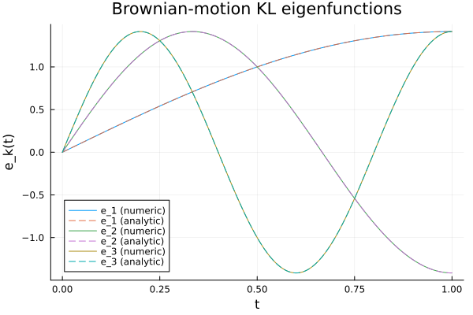
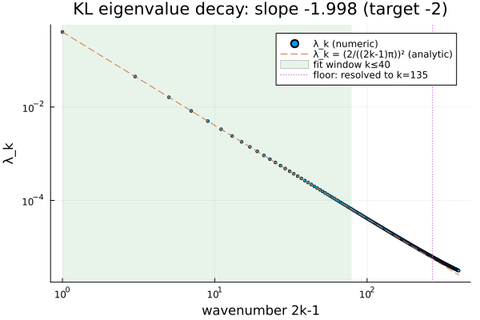
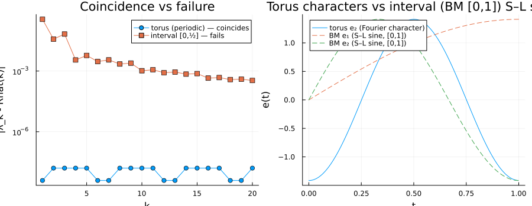
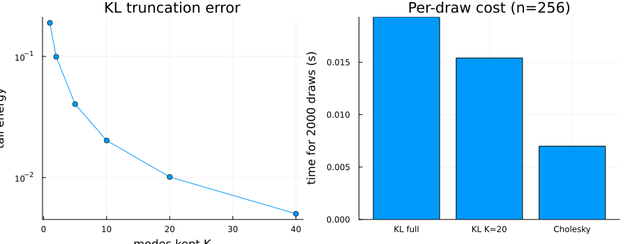

# 02 · Karhunen–Loève quadrature — the operator's own eigenbasis

KL is the *adapted-basis* diagonalization: instead of moving the covariance operator onto the
frequency axis (Unit 1's job, and only possible for stationary processes), it finds the
operator's own eigenbasis on any compact domain. Its eigenvalues double as the variances of the
expansion coefficients — the classical antecedent of PCA / POD. Brownian motion's closed-form
basis certifies the solver, the trace pins assembly, and the torus contrast pins the Fourier ↔ KL
relationship — exact on the circle, broken on the interval.

## The result

By Mercer's theorem the covariance operator `(𝒞f)(t) = ∫₀ᵀ R(t,s) f(s) ds` has an orthonormal
eigenbasis `{e_k}` with eigenvalues `λ_k ≥ 0`. For standard Brownian motion on `[0,1]`
(`R(t,s) = min(t,s)`), Pavliotis's Example 1.29 gives the eigenpairs in closed form:

```
λ_n = (2 / ((2n−1)π))²,      e_n(t) = √2 sin((n − ½)π t)
```

Solve the same eigenproblem numerically by quadrature and overlay the two — numeric solid,
analytic dashed:



They coincide to the discretization's own accuracy (top-5 relative eigenvalue errors run
`1e-6` to `1e-4`; the eigenfunction L² errors below are `1e-15`, i.e. numerically exact once the
sign is aligned). Four checks make this a gate, not a plot, and here is the gate block from the
actual run:

```
(i)  slope(log λ vs log(2k-1)) over k=1..40 = -1.9980 (target -2, gate ±0.15) -> PASS
     resolved range (rel<10%): k=1..135 ; eigenfunction L2 err (modes 1-3) = 1.7e-15, 1.5e-15, 2.6e-15
(ii) trace: sum(λ)=0.500000  trace_diag=0.500000  rel err=2.00e-15 -> PASS
(iii) torus coincidence (n=4096): max_k|λ_k - Rhat(k)| = 2.333e-08  (gate <1e-7) -> PASS
      control: interval [0,0.50] max_k|λ_k - Rhat(k)| (top 20) = 3.603e-01
ALL GATES: PASS
```

## Concept

`λ_k` is one fact with two readings: it is simultaneously (a) the `k`-th eigenvalue of the
covariance operator `𝒞`, and (b) the variance of the `k`-th coefficient in the Karhunen–Loève
expansion `X_t = Σ_k √λ_k · ξ_k · e_k(t)` with `ξ_k` iid `N(0,1)`. That double duty is exactly
what makes KL the classical antecedent of PCA / POD: diagonalizing the covariance and ranking
variance-by-mode are the same computation.

The library (`nystrom_eigen` in `src/kl.jl`) solves the integral eigenproblem
`∫ R(t,s) e(s) ds = λ e(t)` by **Nyström quadrature**: replace the integral with a quadrature rule
(nodes `tᵢ`, weights `wᵢ`), turning it into the discrete problem `(K W) e = λ e` with
`K_ij = R(tᵢ,tⱼ)` and `W = diag(w)`. The catch is that `K W` is **not symmetric**, even though `R`
is — so its eigenvectors are not guaranteed to be orthonormal, or even real. The fix is to solve
the genuinely symmetric problem

```
W^{1/2} K W^{1/2} g = λ g,      e = W^{-1/2} g
```

which is symmetric because `K` is (a similarity transform by the diagonal `W^{1/2}` preserves
eigenvalues and symmetry), and whose eigenvectors, once un-scaled by `W^{-1/2}`, are orthonormal
in the discrete `W`-weighted `L²` inner product `Σᵢ wᵢ e_k(tᵢ)² = 1`. Solving the raw, asymmetric
`K W` is the classic Nyström mistake this module is built to avoid.

## Eigenvalue decay



The BM eigenvalues are *exactly* `λ_k = (2/((2k−1)π))²` — a power law in the **odd
Sturm–Liouville wavenumber** `2k−1`, not in `k` itself. Plotted against `log(2k−1)`, the fitted
slope over `k = 1..40` lands at `-1.998`, essentially exact against the target `-2`. Plotted
against the naive `log k` instead, the same data fits to `-2.211` — curvature from the `2k−1` vs
`2k` mismatch at small `k`, not a bug, but a reminder that the choice of abscissa is part of the
claim, not an afterthought. Both slopes are printed by `run.jl`.

The **resolved range** is stated explicitly rather than assumed: eigenvalues stay within 10%
relative error of the closed form through `k = 1..135` (annotated by the dotted floor line in the
figure); past that, quadrature discretization noise dominates and the decay visibly flattens away
from the analytic line. The slope gate deliberately fits only `k ≤ 40`, well inside the resolved
window — fitting into the floor would be measuring quadrature noise, not the operator.

## Trace identity

The trace of the covariance operator equals the sum of its eigenvalues: `Tr 𝒞 = Σ_k λ_k =
∫₀ᵀ R(t,t) dt`. For Brownian motion, `R(t,t) = t`, so `∫₀¹ t dt = ½` — **not** `T·R(0)`, which
would give `0` since `R(0,0) = min(0,0) = 0`. (The `T·R(0)` shortcut only works for *stationary*
kernels, where the diagonal `R(t,t)` is a constant `R(0)`; BM is the non-stationary case where
that shortcut is a silent bug.) The run confirms both sides of the identity from the same
quadrature: `sum(λ) = 0.500000`, `trace_diag = 0.500000`, relative error `2.00e-15` — machine
precision, because both quantities are the trace of the *same* discretized matrix computed two
different ways (sum of eigenvalues vs sum of weighted diagonal entries), so they must agree to
floating-point accuracy regardless of whether the eigensolve itself is accurate at any particular
`k`. As a check that the identity generalizes, the run also verifies the **stationary
specialization** `Σ λ_k = T · R(0)` on the periodic kernel: `sum(λ_torus) = 1.000000` against
`T·R(0) = 1.000`.

## Torus contrast



`periodic_kernel` lives on a genuine group (the circle), so its covariance operator is a
convolution, and convolutions are diagonalized *exactly* by the Fourier characters. That means its
Fourier coefficients

```
Rhat(k) = 2α(1 − (−1)^k e^{−α/2}) / (α² + (2πk)²)
```

are not merely related to the KL eigenvalues — they **are** them: `λ_k = Rhat(k)`, the "torus
coincidence." The run verifies this on an `n = 4096` grid: `max_k|λ_k − Rhat(k)| = 2.333e-08`,
against a gate of `< 1e-7`. That residual is deliberately **not** machine-zero: it is quadrature
aliasing, `O(1/n²)` in the periodic-trapezoid rule, so it shrinks as the grid refines but never
vanishes at finite `n`. The gate is set at `1e-7`, one order above the observed residual — a
correction of the original spec's `1e-8`, which undershoots what an `O(1/n²)` floor at `n = 4096`
actually delivers; tightening the gate to `1e-8` would make the check flicker between pass and
fail on ordinary rounding noise rather than testing the coincidence itself.

The left panel of the figure is that gap, `|λ_k − Rhat(k)|`, for the torus (flat near `1e-8`,
"coincides") against the interval control (`O(1)`, "fails") — the *why* is the right panel: the
torus eigenfunctions are Fourier **characters** (full-period sinusoids, no boundary condition to
satisfy), while a bounded interval forces **Sturm–Liouville sines** instead, because a boundary
condition (Dirichlet at the endpoints, for BM) has to be met. Same covariance-operator machinery,
different domain topology, different basis. The right panel's Sturm–Liouville representatives are
the BM Example-1.29 eigenfunctions on `[0,1]` — the same ones shown in "The result" above — chosen
because they put the cleanest torus-vs-Dirichlet contrast on one axis; they are **not** the same
object as the `[0,½]` OU-kernel control in the left/gap panel, which uses the sub-period interval
of `periodic_kernel` itself rather than BM. Both are "the interval," but two different kernels
make the two different points (character-vs-sine shape here; coincidence-breaking there).

One more reason this check needed an in-house derivation of `Rhat(k)`: Pavliotis's own worked
torus example (Exercise 27) uses the kernel `cos 2π(t−s)`, which is **rank 2** — only two nonzero
eigenvalues, everything else exactly zero. That is too degenerate to fit a decay slope or probe a
quadrature floor against. `periodic_kernel`'s Fourier coefficients are strictly positive for every
`k` (a full spectrum), which is what makes it usable as a genuine torus contrast to Unit 2's
eigenvalue-decay story rather than a two-point special case.

## Negative control

The same `periodic_kernel`, evaluated on the sub-period interval `[0, ½]` instead of the full
circle `[0,1]`, is — by the kernel's own definition — just the ordinary (non-periodic)
exponential/OU kernel on that shorter interval. Nothing about the *kernel* changed; only the
*domain* it's quadrature-integrated over did. That alone is enough to break the coincidence: the
gap jumps from `~2e-8` (torus) to `3.603e-01` (interval, top-20 modes) — eight orders of magnitude,
on purpose. The lesson is domain, not kernel: put a boundary anywhere on a stationary kernel's
domain and its KL eigenfunctions stop being Fourier characters and become Sturm–Liouville sines,
which no longer coincide with the unconstrained torus Fourier coefficients.

## Truncation cost / accuracy



Truncating the KL expansion at `K` modes discards a fraction of the total variance,
`Σ_{k>K} λ_k / Σ_k λ_k` — and because KL orders modes by variance, this is the *optimal* K-term
approximation (no other K-dimensional basis discards less):

| K kept | 1 | 2 | 5 | 10 | 20 | 40 |
|---|---|---|---|---|---|---|
| tail energy | 0.1894 | 0.0994 | 0.0404 | 0.0202 | 0.0101 | 0.0050 |

Twenty modes out of 256 already retain 99% of the variance. On the practical-payoff side
(Exercise 28), the run times three square roots of the same `n = 256` covariance — full KL,
truncated KL (`K = 20`), and Cholesky — over 2000 draws, seeded and with a warm-up draw excluded
from the timings:

```
cost (n=256, 2000 draws): setup KL=0.004s Chol=0.075s | draws KL(full)=0.020s KL(K=20)=0.018s Chol=0.007s
```

Two honest readings, not one tidy story. **Setup is where KL wins clearly:** the symmetric
eigensolve (`nystrom_eigen`) is roughly 19× cheaper to compute than the dense Cholesky
factorization at this size (`0.004s` vs `0.075s`) — and unlike Cholesky, it is a one-time cost
that also hands back the *ranked* variance decomposition used for truncation. **Truncation also
helps, modestly:** `K=20` draws (`0.018s`) beat full-rank KL draws (`0.020s`) for 2000 draws,
consistent with the `O(nK)` cost of `eigfuncs[:, 1:K] * (√λ .* ξ)` against `O(n²)` for the full
expansion or a full triangular solve. **But at this modest `n = 256`, raw Cholesky per-draw
(`0.007s`) is the fastest of the three** in wall-clock terms — a single dense BLAS matrix-vector
product at `n = 256` has small enough constant factors that it beats even the truncated KL
matvec, whose asymptotic `O(nK)` advantage only dominates once `n` grows large relative to `K`.
The tail-energy table is the load-bearing artifact of this section; the per-draw timings are a
single-shot wall-clock comparison at one grid size, included for context, not as a
substitute for a proper scaling study.

## Recorded configuration

Reproducibility conventions (why an explicit seed, the Cholesky-nugget convention) live in the
[top-level README](../../README.md#conventions); this unit's concrete values:

- **Domain:** `T = 1.0` — Pavliotis fixes `T = 1` in §1.5.
- **Brownian-motion grid:** `N_BM = 400` (trapezoid quadrature), fit window `KFIT = 40`.
- **Torus grid:** `N_TORUS = 4096` (periodic quadrature), `α = 1.0`.
- **Cost study grid:** `N_COST = 256`, `N_PATHS = 2000` draws, truncation level `K_TRUNC = 20`,
  Cholesky nugget `JITTER = 1e-10` (reported per the project convention).
- **Seed:** `StableRNG(20240715)` — the *only* stochastic object in the experiment is the cost
  study's draws; all three gates ((i) slope, (ii) trace, (iii) torus coincidence) are fully
  deterministic given the quadrature grid, so they reproduce exactly on every run, independent
  of the seed.

This experiment is Monte-Carlo-adjacent (one stochastic component) — run it locally
(`julia --project=experiments experiments/02_kl_quadrature/run.jl`); it is **not** part of CI (the
`n = 4096` torus eigensolve is heavy). The four figures above are committed artifacts, and the
deterministic identities it relies on (`quad_nodes_weights`, `nystrom_eigen`, `trace_diag`,
`kl_tail_energy`, `sample_kl`) are covered by the Phase 2–3 testsets in `test/runtests.jl`.
