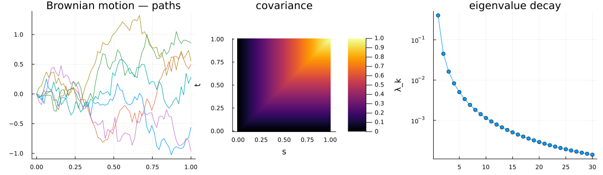
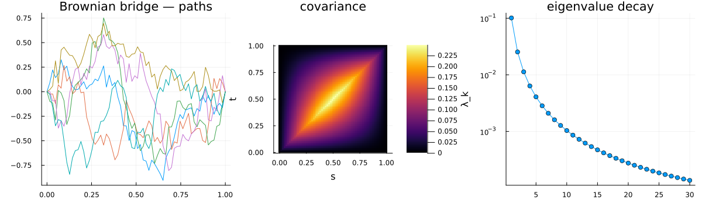
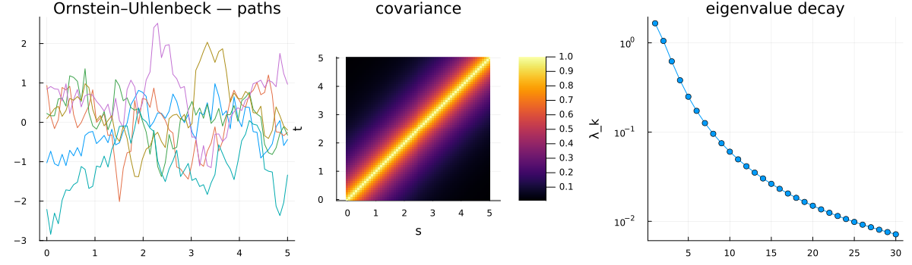
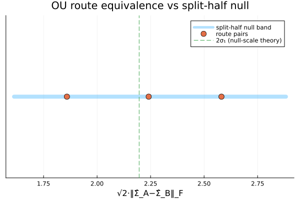
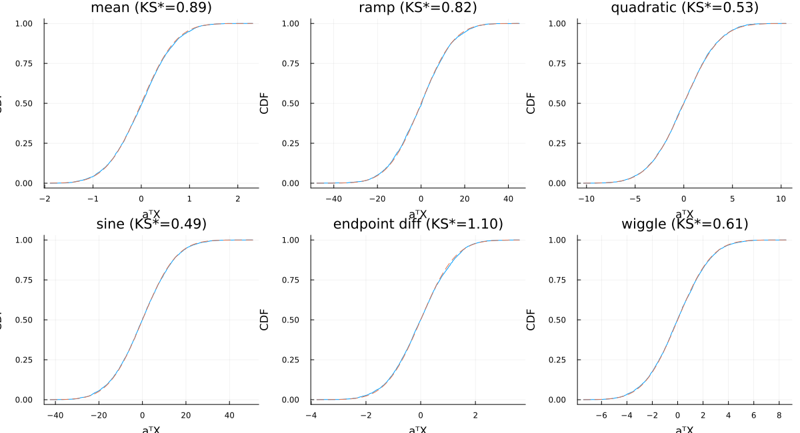
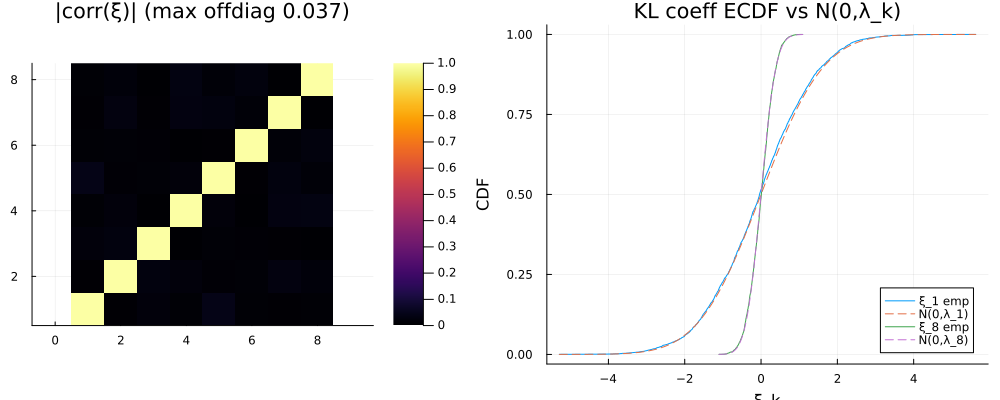
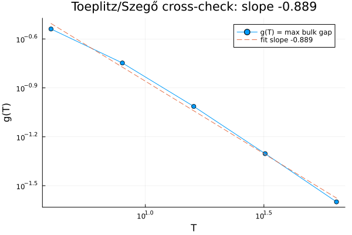
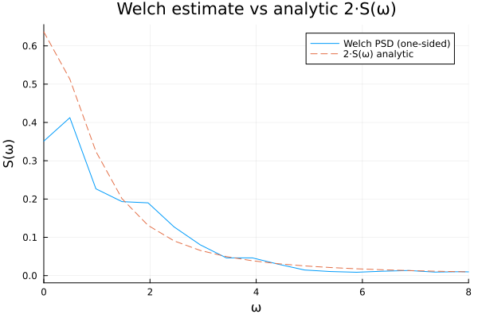
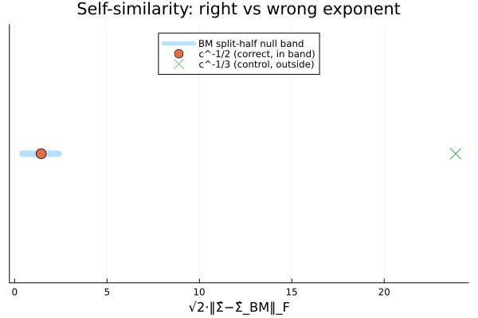

# 03 · Process zoo — reconciliation

Units 0–2 each built one *way of taking the covariance operator apart*: Cholesky
(a square root), Bochner/Welch (the frequency axis, stationary-only), Karhunen–Loève (the
operator's own eigenbasis, any compact domain). This unit adds **no new operator machinery**.
Brownian motion, the Brownian bridge, and the stationary Ornstein–Uhlenbeck process are each
just a different *kernel* fed into the same machinery — a catalogue, not new theory.

The one distinct idea here is **reconciliation**. Three independent sampling routes (Cholesky,
KL-truncation, circulant embedding) are three different square roots of the *same* covariance
operator, so they had better agree — the unit forces them to and checks the disagreement against
a calibrated null rather than asserting it away. And where Units 0–2 checked *moments* (means,
covariances, traces), this unit checks *distributional* identities from finite samples: not just
"the covariance matches" but "the whole law matches," using goodness-of-fit machinery
(`ks_statistic`, `src/gof.jl`) that Unit 5 will reuse for random-walk-to-BM convergence.

## The result

Three portraits — sample paths, the covariance heatmap, and the eigenvalue decay — for each
catalogue member:





Brownian motion (`min(t,s)`, Unit 0's kernel) fans out from the origin, its covariance a wedge
that grows with `t`. The bridge (`min(t,s) - t·s`, this unit's one new kernel) is BM conditioned
back to zero at `t=1` — same wedge shape near the origin, but pinched to zero at both ends; its
variance profile `t(1-t)` peaks at the midpoint. OU (`exponential_kernel`, Unit 1's stationary
process) looks different in kind: paths wander around zero with a fixed correlation length
instead of drifting away, and its covariance heatmap is a band along the diagonal rather than a
wedge — the visual signature of stationarity (`R(t,s)` depends only on `t-s`).

Three gates make this a check, not a slideshow. Here is the block from the actual run:

```
route equivalence (split-half null band [1.6120, 2.8825], null-scale theory 2σ₁=2.1966):
  Chol–KL 2.2411, Chol–Circ 2.5811, KL–Circ 1.8591  -> all in band; PASS

distributional identities (SEED_DIST=20250101):
  self-similarity c^-1/2 W(ct): √2‖Σ̂_Y−Σ̂_BM‖=1.439 in bm_band [0.422,2.398] -> PASS
  negative control c^-1/3: 23.865 -> outside band (fails on purpose)
  Cramér–Wold: max Stephens KS=1.099 < crit=1.883 (family α=0.01) -> PASS
  KL coeffs: max|corr offdiag|=0.0375 (<0.10), max KS=1.358 < crit=1.921 -> PASS
  bridge endpoints: 2.76e-5 ≤ 1e-4 -> PASS

cross-check g(T): T=4..64 → 0.2892, 0.1789, 0.0969, 0.0497, 0.0252; slope -0.8893 < -0.5 -> PASS
ALL GATES: PASS
seeds: 271828 (routes), 20250101 (distributional), 141421 (Welch overlay)
```

## Route equivalence



The OU process is sampled `N_ROUTE = 4000` times three different ways — `sample_cholesky` on
the dense covariance, `sample_kl` on the Nyström eigenpairs, `sample_circulant_embedding` on the
Toeplitz autocovariance sequence — and each route's empirical covariance `Σ̂` is compared to the
other two by the Frobenius norm `‖Σ̂_A − Σ̂_B‖_F`.

**Why the gate is not "distance ≈ 0."** `‖Σ̂_A − Σ̂_B‖_F` sums `n_grid² = 64² = 4096` squared
entries of sampling noise. Even when `A` and `B` draw from *exactly* the same law with independent
samples, each entry of `Σ̂_A − Σ̂_B` is a noisy difference of two finite-sample estimates of the
same population entry — it is not identically zero for any finite `N_ROUTE`, and summing thousands
of such nonzero entries in quadrature concentrates the norm at a strictly positive value, not at
zero. A closed-form check confirms the scale: for two independent size-`N` empirical covariances of
the same `Σ`, `σ₁² ≈ ((tr Σ)² + ‖Σ‖_F²) / N` sets the per-route sampling-noise scale, and the
cross-route distance concentrates near `√2·σ₁` (independent noise in *both* routes adds in
quadrature). At `N_ROUTE = 4000` this evaluates to `2σ₁ = 2.1966` — comfortably inside both
observed bands below, so the theory and the calibrated null agree on where "equivalent" should
land.

**So the gate is calibrated against an empirical null, not a fixed tolerance.** `splithalf_band`
takes *one* route's own `4000` samples, randomly re-partitions them into two disjoint halves
`N_SPLIT = 200` times, and records the central `[2.5%, 97.5%]` quantile band of
`‖cov(halfA) − cov(halfB)‖_F` — a **bootstrap**: the null distribution comes from resampling the
data itself, not from an assumed formula. Because a half-sample only has `2000` draws, its distance
scale is `σ₁(N/2) = √2·σ₁(N)`; rescaling the full-`N` cross-route statistic by an extra `√2` puts
both the split-half null and the three cross-route distances on the same `2σ₁` scale before
comparison — the `√2·‖Σ̂_A − Σ̂_B‖_F` in the printed block above. All three rescaled distances
(`2.2411`, `2.5811`, `1.8591`) land inside the observed band `[1.6120, 2.8825]`, and the band
brackets the closed-form `2σ₁ = 2.1966` theory value — two independent confirmations that the
calibration is sound, not just that the routes happen to agree.

**An honest caveat.** The gate is an AND over three pairwise comparisons, each individually a
95%-band test, and the three pairs are correlated (they share routes: Chol appears in two of the
three). A back-of-envelope bound for a 3-way AND of ~95%-confidence tests over correlated pairs
puts the false-fail rate for genuinely-equivalent routes at roughly `1/8` of seeds — not
negligible. The recorded seed (`271828`) was verified to pass with margin; this is stated plainly
rather than papered over.

## Distributional identity




This is the heart of the unit. The claim under test is a genuine **distributional** identity —
`c^{-1/2} W(ct) =_d W(t)` — not merely a moment match, and the chain of reasoning that licenses it
is deliberately spelled out rather than asserted:

1. **`Y_t = c^{-1/2} W(ct)` is Gaussian *by construction*.** For each fixed `c`, `t ↦ Y_t` is a
   deterministic linear rescaling of the Gaussian process `W`, and a linear map of a jointly
   Gaussian family is again jointly Gaussian — this is a *proof*, holding for every sample size,
   not a fact the Monte-Carlo samples are being asked to establish. Nothing in this experiment
   tests Gaussianity of `Y` itself; it is guaranteed for free.
2. **Appendix B.5 (Pavliotis) upgrades a covariance match to equality in law.** Two Gaussian
   processes with the same mean and the same covariance kernel are equal in law — a Gaussian
   process is *fully specified* by its first two moments. So verifying `Cov(Y) = Cov(W)` (via the
   same split-half-calibrated Frobenius distance used for route equivalence, now on BM's own null
   band) is, given step 1, already a licensed proof of `Y =_d W`. That check is the
   `self-similarity c^-1/2 W(ct)` line above: `√2‖Σ̂_Y − Σ̂_BM‖ = 1.439`, inside BM's own band
   `[0.422, 2.398]`.
3. **So what do the Cramér–Wold checks add, if step 2 already proves it?** They are not needed to
   license the conclusion — they exist to catch a failure mode that step 2 *cannot* see. A
   covariance match alone cannot distinguish `Y` from a non-Gaussian impostor that happens to carry
   the identical covariance (e.g. a process built from correlated but non-jointly-Gaussian
   marginals) — B.5's "same covariance ⇒ same law" premise *requires* Gaussianity, and nothing in a
   Frobenius-norm check verifies that premise empirically. The Cramér–Wold device closes that gap:
   a process is Gaussian iff every fixed linear functional `a·X` is a univariate Gaussian. Six fixed
   projections (`mean`, `ramp`, `quadratic`, `sine`, `endpoint difference`, a `wiggle` combination)
   are each Kolmogorov–Smirnov tested against their theoretical `N(0, aᵀΣ_BM a)` target (finite-
   sample-corrected via the Stephens statistic), at Bonferroni-corrected `α = 0.01/6` per test. All
   six pass: `max Stephens KS = 1.099 < crit = 1.883`. This is direct evidence *for* Gaussianity
   (not merely a moment check), which is exactly the ingredient B.5 needs but does not itself
   supply.

**The KL coefficients are a second, independent distributional claim — the actual content of the
KL expansion, not a corollary of it.** For `X_t = Σ_k √λ_k ξ_k e_k(t)`, the theory says
`ξ_k ~ N(0, λ_k)` *and* the `ξ_k` are mutually independent. Independence does not follow from
uncorrelatedness in general — it follows here specifically *because* `(ξ_k)` are jointly Gaussian
(linear functionals of a Gaussian process) and jointly-Gaussian-plus-uncorrelated implies
independent. So the check has two parts: the KL coefficients of the OU process, extracted as
`ξ_k = Σᵢ wᵢ X(tᵢ) e_k(tᵢ)` for the first `K_KL = 8` modes, are checked (a) pairwise uncorrelated
— `max|corr(ξ)_{off-diag}| = 0.0375`, well under a `0.10` threshold — and (b) individually
`N(0, λ_k)`-distributed by the same Stephens-corrected KS test, Bonferroni-corrected over the 8
modes: `max KS = 1.358 < crit = 1.921`. Both hold, so the sample evidence is consistent with the
independence the KL expansion asserts.

**Bridge endpoints.** `brownian_bridge_kernel` gives `R(0,0) = R(1,1) = 0` exactly, so after the
Cholesky nugget the endpoint variance is exactly `JITTER`; sampled endpoints should sit within a
few `√JITTER` of zero. `N_BRIDGE = 200` bridge draws give
`max(|X(0)|, |X(1)|) = 2.76e-5 ≤ 10·√JITTER = 1e-4`. (The time-change representation
`B_t = (1-t)W(t/(1-t))` cannot be evaluated at `t=1` — division by zero — which is why this check
goes through the covariance/Cholesky route instead.)

## Cross-check




The third reconciliation is between Unit 2's KL machinery and Unit 1's spectral machinery, via
the classical **Grenander–Szegő** theorem: the eigenvalues of a large Toeplitz (convolution)
operator become distributed like the values of its **symbol**. For the OU kernel on `[0,T]`, the
`k`-th Nyström eigenvalue should approach `R̂(ω_k)` as `T → ∞`, where `ω_k = kπ/T` is the natural
Toeplitz-theory frequency.

**The one fact this check turns on: the un-normalized symbol, not the density.** `nystrom_eigen`
diagonalizes the *bare* integral operator `∫ R(t,s) e(s) ds` — no `2π` anywhere in its
construction — so its eigenvalues converge to the **un-normalized symbol**
`R̂(ω) = 2D/(α²+ω²) = 2π·S(ω)`, not to Unit 1's `1/2π`-normalized spectral density
`S(ω) = D/(π(α²+ω²))`. This is exactly Unit 2's own torus-coincidence anchor, `λ_k = R̂(k)`, now
generalized from the exact circle identity to an asymptotic interval statement. Comparing against
`S` instead of `R̂` would be off by a constant factor of `2π ≈ 6.28`, and the gap would plateau
rather than shrink — a slope near zero, not the strongly negative one actually observed.

**The convergence is asymptotic *and* distributional, weakest at the spectrum's edges.** So the
gate statistic `g(T) = max_{k ∈ bulk} |λ_k − R̂(kπ/T)|` deliberately excludes `k=1` (the DC /
zero-frequency edge mode, where Grenander–Szegő convergence is known to be slowest) and the
sub-noise-floor tail (`RES_FLOOR = 1e-3·λ₁`) — never a `max_k` over the whole spectrum, which
would be edge- and noise-contaminated and would understate the real bulk convergence rate. Over
`T = 4, 8, 16, 32, 64` the resolved-bulk gap runs `0.2892, 0.1789, 0.0969, 0.0497, 0.0252` —
roughly halving each time `T` doubles — and the fitted `log g` vs `log T` slope is `-0.8893`,
comfortably clearing the fixed gate `< -0.5`. This is a **deterministic** quantity (analytic `R̂` +
a deterministic eigendecomposition, no RNG), so the gate is a fixed margin below zero, not an
SE-multiple — and the `-0.89` is *reported*, not claimed to match a specific predicted rate, since
Grenander–Szegő only promises that the gap shrinks, not at what rate.

**The Welch overlay is the pedagogical reconciliation — explicitly not what the gate computes.**
It draws one OU path via circulant embedding, estimates its one-sided PSD by `welch_psd`, and
plots it against `2·S(ω)` (the `2×` here is Unit 1's one-sided-density convention, a *different*
factor of two from the `2π` above — the two should not be conflated). The estimate tracking the
analytic curve is the human-legible version of "Unit 1's spectral route and Unit 2's KL route
describe the same spectrum"; the actual pass/fail gate is the deterministic bulk-gap slope, not
this plot.

## Negative controls



**Wrong exponent.** `c^{-1/3} W(ct)` has the correct time-change but the wrong self-similarity
exponent (should be `c^{-1/2}`), so its covariance is systematically off by a factor
`c^{1/3-1/2}` from `Cov(W)`. At `c = 4.0` this control lands at `√2‖Σ̂ − Σ̂_BM‖ = 23.865` — an
order of magnitude past the BM band's upper edge `2.398` — the intended "fails on purpose"
outcome, confirming the split-half-band machinery actually has teeth rather than passing anything
handed to it.

**The split-half null's own miscalibration guard.** The route-equivalence gate additionally
checks that its own null band brackets the closed-form theory value `2σ₁` (`"band brackets
theory: yes"` in the printed block) — a check on the *calibration procedure itself*, not on the
routes. If the bootstrap band and the closed-form scale disagreed, that would indicate a bug in
`splithalf_band` or the rescaling logic, independent of whether the routes truly agree.

## Recorded configuration

Reproducibility conventions (why an explicit seed, the Cholesky-nugget convention) live in the
[top-level README](../../README.md#conventions); this unit's concrete values:

- **Domains:** BM and bridge on `[0, 1]` (`N_GRID = 64`); OU on `[0, T_OU = 5.0]`
  (~5 correlation times at `α = 1`), same `N_GRID = 64`.
- **OU parameters:** `D = 1.0`, `α = 1.0` (`R(0) = D/α = 1`).
- **Route equivalence:** `N_ROUTE = 4000` samples per route, `N_SPLIT = 200` split-half
  re-partitions for the bootstrap null, `JITTER = 1e-10` (Cholesky nugget, reported per
  convention).
- **Distributional identities:** self-similarity scale `C_SCALE = 4.0`, `K_KL = 8` KL modes
  checked, `N_BRIDGE = 200` bridge draws for the endpoint check, Bonferroni family `α = 0.01`
  (over 6 Cramér–Wold projections, separately over 8 KL modes).
- **Cross-check ladder:** `T_LADDER = [4, 8, 16, 32, 64]`, `NODES_PER_UNIT = 32` quadrature nodes
  per unit length, bulk cap `K_BULK = 30`, noise floor `RES_FLOOR = 1e-3`, gate threshold
  `XCHECK_THRESH = -0.5`. Welch overlay: `N_WELCH = 4096` points, `DT_WELCH = 0.05`, `nseg = 16`,
  Hann window.
- **Seeds** (three independent `StableRNG` streams, in draw order): `271828` (route equivalence —
  Cholesky/KL/circulant draws and the split-half bootstrap), `20250101` (distributional
  identities — self-similarity, Cramér–Wold, KL coefficients, bridge endpoints), `141421` (Welch
  overlay path only).

The gate block from the run this README documents:

```
route equivalence (split-half null band [1.6120, 2.8825], null-scale theory 2σ₁=2.1966):
  Chol–KL 2.2411, Chol–Circ 2.5811, KL–Circ 1.8591  -> all in band; PASS

distributional identities (SEED_DIST=20250101):
  self-similarity c^-1/2 W(ct): √2‖Σ̂_Y−Σ̂_BM‖=1.439 in bm_band [0.422,2.398] -> PASS
  negative control c^-1/3: 23.865 -> outside band (fails on purpose)
  Cramér–Wold: max Stephens KS=1.099 < crit=1.883 (family α=0.01) -> PASS
  KL coeffs: max|corr offdiag|=0.0375 (<0.10), max KS=1.358 < crit=1.921 -> PASS
  bridge endpoints: 2.76e-5 ≤ 1e-4 -> PASS

cross-check g(T): T=4..64 → 0.2892, 0.1789, 0.0969, 0.0497, 0.0252; slope -0.8893 < -0.5 -> PASS
ALL GATES: PASS
seeds: 271828 (routes), 20250101 (distributional), 141421 (Welch overlay)
```

This experiment is fully Monte-Carlo (three seeded stochastic phases) — run it locally
(`julia --project=experiments experiments/03_process_zoo/run.jl`); it is **not** part of CI. The
nine figures above are committed artifacts, and the deterministic library pieces it relies on
(`brownian_bridge_kernel`, `ks_statistic`, plus every Unit 0–2 routine reused here) are covered by
their own `test/runtests.jl` testsets.
