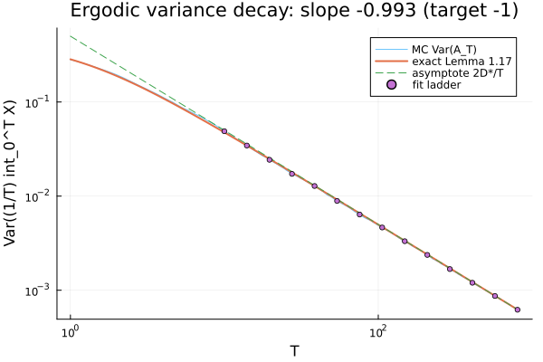
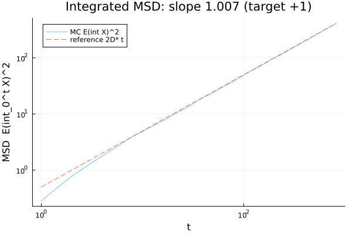
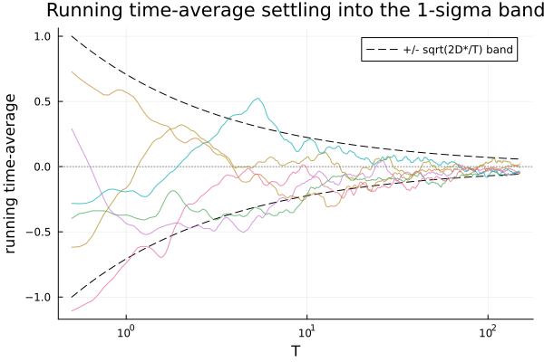
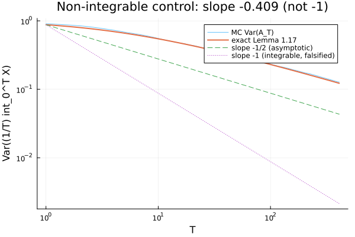

# 04 · Ergodicity — the theorem behind the method

Every unit before this one compares **one** Monte-Carlo run against a closed-form target and
calls a match a success. That move is only legitimate if a single long path actually *sees* the
whole distribution — if its time-average converges to the ensemble mean. This unit demonstrates
the theorem that grants exactly that permission (Pavliotis **Prop. 1.16**, the L² law of large
numbers for stationary processes with an integrable correlation), measures its exact finite-time
rate, reads off the Green–Kubo transport coefficient, and then — to prove the theorem's one
hypothesis is load-bearing and not decorative — **breaks it on purpose** with a process the
theorem does not cover.

It adds **no new operator machinery**. It adds the estimators (`src/ergodic.jl`) that watch the
ergodic loop close, and the experiment that certifies it closes at the predicted rate.

## The result

The headline is a straight line where a theorem says there should be one: the variance of a single
path's time-average decays as `1/T`, riding the exact finite-T curve onto its asymptote.



```
Green-Kubo D* = green_kubo(r,dt) = 0.250208  (analytic D/alpha^2 = 0.250000)
GATE (a) variance slope: -0.9926;  |slope+1| = 0.0074  vs  2.5*SE = 0.0164  (SE_grp 0.0066, SE_ols 0.0023) -> PASS
GATE (b) constant: median(T*Var) = 0.49481  vs  2 D* = 0.50042  (rel 0.0112, 2R(0)=1.000 would be wrong) -> PASS
DIAGNOSTIC MSD slope: 1.0074 +/- 0.0023 (integrated restatement of gate (a); target +1)
CONTROL slope: MC -0.4092  exact -0.4207;  |MC-exact| = 0.0116  vs  2.5*SE = 0.0342  (c1 PASS);  slope > -0.75 (c2 PASS; -1 would be FALSE) -> PASS

recorded: seed=20260718, D=1.0, alpha=2.0, dt=0.050, n_grid=16384, n_ens=4000, Dstar=0.25021 | control: seed=13579, n_c=4096, dt_c=0.10, n_ens_c=2000, jitter=1.0e-10
ALL GATES: PASS
```

## Concept

For a stationary, zero-mean process the **time-average** of one path is
`A_T = (1/T) ∫₀ᵀ X_s ds`. Prop. 1.16 says that if the correlation `C(u) = E[X_s X_{s+u}]` is
integrable (`C ∈ L¹`), then `A_T → μ` in mean square as `T → ∞`. Every sampler in this repo draws
a zero-mean law, so `μ = 0` and the mean-square of `A_T` *is* its variance about the true mean —
the quantity we can watch shrink.

**Lemma 1.17** gives that variance exactly, at every finite `T`, before any limit:

```
Var(A_T) = (2/T²) ∫₀ᵀ (T − u) C(u) du   ⟶   2·D*/T   as T → ∞.
```

Two facts fall out, and they are the two gates below: the *slope* of `Var(A_T)` vs `T` is `−1`,
and its *constant* is `2·D*`, where

```
D* = ∫₀^∞ C(u) du       the Green–Kubo transport coefficient (Pavliotis Example 1.18).
```

> **Key insight —** `D*` is **not** the variance at zero lag. For the OU correlation
> `C(u) = (D/α)·e^{−α|u|}` the two are
> `R(0) = C(0) = D/α`  and  `D* = ∫₀^∞ C = D/α²` — equal only at `α = 1`. The decay constant
> carries `α²`, not `α`. This experiment deliberately runs at **α = 2**, so `2·D* = 0.5` sits a
> clean factor of two below `2·R(0) = 1.0`: gate (b) then has to land on `0.5` to pass, which
> pins the `α²` and would catch any code path that computed `D/α` instead of `D/α²`.

`D*` itself is not hard-coded — it is computed by the library's `green_kubo(r, dt)` (trapezoid
rule over the covariance sequence), which returns `0.250208`, matching the analytic `D/α² = 0.25`
to five decimals. The analytic value is *checked*, not assumed.

## Gate (a) — the 1/T slope, and an honest error bar

One seeded OU ensemble (4000 paths, circulant embedding, one path per column) drives everything.
`Var(A_T)` is fit against `T` on a 14-point geometric ladder in the deep-asymptotic regime
(`T ≥ 10`, about twenty correlation times past `1/α = 0.5`), giving slope **−0.9926** against the
target `−1`.

The subtle part is the error bar. The ladder points are **nested prefixes of one path matrix**, so
successive points are strongly autocorrelated and the textbook OLS residual SE under-reports the
true uncertainty — here by roughly 3× (`SE_ols = 0.0023`). The honest SE comes instead from
re-fitting the same ladder on **`NGROUP = 20` disjoint sub-ensembles** and taking the spread of
those independent slopes: `SE_grp = 0.0066`. The gate uses that: `|slope + 1| = 0.0074 < 2.5·SE_grp
= 0.0164`, about 1.1 SE of headroom. The OLS SE is printed only for contrast, to make the ~3×
under-estimate visible.

## Gate (b) — the constant that pins α²

Slope-free and robust: on the plateau `T ≥ 20` the product `T·Var(A_T)` flattens to `2·D*`, so the
gate reads the **median** of those plateau products (robust to the estimator's growing tail
scatter) against `2·D*` within 5% relative. Realized `median(T·Var) = 0.49481` vs `2·D* = 0.50042`,
a 1.1% relative gap — PASS. The printed line also shows `2·R(0) = 1.000`, the value the wrong
constant would give, so the discrimination is on the page.

## Diagnostic — the integrated MSD



The integrated mean-square displacement `E[(∫₀ᵗ X_s ds)²]` grows as `2·D*·t`, fitted slope
**1.0074**. This is *not* a third gate: it equals `t²·Var(A_T)` on the same paths as an exact
algebraic identity (the running average is the integral divided by `t`), so its slope is
necessarily gate (a)'s slope `+2`. Both estimators share one `_cumulative_integral` helper, so the
`+2` offset holds by construction — the diagnostic confirms that identity survives on real data
rather than measuring anything new.

## Convergence, visualized



This is Prop. 1.16 made literal: six individual running time-averages (columns 1–6 of the same
ensemble) start scattered at order 1 and funnel into the shrinking `±√(2·D*/T)` envelope, settling
toward the true mean 0 as `T` grows. One path's time-average converging in L² to the ensemble mean
is the whole methodology of Units 0–3, seen happening.

## Negative control — break the hypothesis, break the rate

The 1/T rate above was the theorem *doing work* — but only if its `C ∈ L¹` hypothesis is actually
load-bearing. To show it is, the **same** `time_average_variance` estimator is fed a *different*
synthetic stationary process with correlation

```
C(u) = (1 + u)^{-1/2}.
```

This `C` is a genuine covariance — positive-definite by **Pólya's criterion** (real, even, convex,
decreasing to 0 with `C(0) = 1`), hence Cholesky-samplable — but its tail decays too slowly to
integrate: `∫₀^∞ (1+u)^{-1/2} du = ∞`. So `D*` diverges, Prop. 1.16 does not apply, and the clean
collapse to `2·D*/T` cannot happen.



The observed slope comes in at **−0.4092** — nowhere near the `−1` an integrable `C` would force.
Two design notes make this rigorous rather than hand-wavy:

- **Why not `−1/2`?** The true asymptotic slope for this `C` *is* `−1/2`, but Lemma 1.17's exact
  finite-T curve reaches it only very slowly — a correction of the form `slope ≈ −1/2 + 0.75/√T`
  keeps the local slope well above `−1/2` at any `T` this control can afford. Reaching `−1/2`
  numerically would need `T_max` in the thousands, infeasible under the O(n³) Cholesky this control
  uses (it factors the literal `4096×4096` Toeplitz covariance once, because circulant embedding is
  not guaranteed PSD for a slowly-decaying kernel). So the gate does **not** chase `−1/2`.

- **What gate (c) actually checks.** Two parts. **(c1)** the MC slope must track the *exact*
  finite-T Lemma-1.17 slope for this same `C` — `|MC − exact| = |−0.4092 − (−0.4207)| = 0.0116 <
  2.5·SE = 0.0342` — confirming the estimator reproduces the true finite-T behavior. **(c2)** that
  slope must be clearly shallower than `−1` (`slope > −0.75`), which falsifies the integrable-case
  rate. Both pass. Gate (c) thus bites in both directions: a bug that restored a `1/T` decay would
  trip (c2), and one that warped the finite-T shape would break (c1).

The falsifier fires exactly as intended, and the L¹ hypothesis is confirmed load-bearing.

## Recorded configuration

Reproducibility conventions (why an explicit seed, the Cholesky-nugget rule) live in the
[top-level README](../../README.md#conventions); this unit's concrete values:

- **Main OU ensemble:** `D = 1.0`, `α = 2.0` (so `2·D* = 0.5 ≠ 2·R(0) = 1.0`), `dt = 0.05`
  (Nyquist `π/dt ≈ 63 ≫ α`), `n_grid = 2^14 = 16384` (→ `T_max ≈ 819`, over 1600 correlation
  times), `n_ens = 4000`, seed `20260718`. Fit from `T ≥ 10` on a 14-point geometric ladder;
  gate (b) plateau at `T ≥ 20`.
- **Slope SE:** `NGROUP = 20` disjoint sub-ensembles (shared by gates (a) and (c)); the OLS
  residual SE is a lower bound, printed only for contrast.
- **Non-integrable control:** `C(u) = (1+u)^{-1/2}`, `n_c = 4096`, `dt_c = 0.1` (→ `T_max ≈ 410`),
  `n_ens_c = 2000`, `jitter = 1e-10` (Cholesky nugget, reported), seed `13579` — an independent
  `StableRNG` consumed strictly *after* the main stream, so it cannot perturb gate (a)/(b)'s
  numbers.

This experiment is fully Monte-Carlo — run it locally
(`julia --project=experiments experiments/04_ergodicity/run.jl`); it is **not** part of CI. The
four figures above are committed artifacts, and the deterministic library pieces it drives
(`running_time_average`, `time_average_variance`, `mean_square_displacement`, `green_kubo`,
`time_average_variance_exact` in `src/ergodic.jl`) are covered by the `Ergodic` testset in
`test/runtests.jl`.
